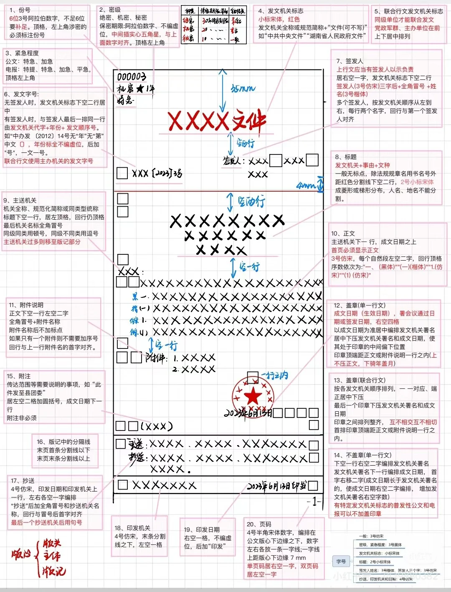

---
tags:
  - "#公考/公基"
connect-url: https://www.bilibili.com/video/BV1SL4y1G7mC
---
## 概述

1. 概念：公文是种具有特定效力和规范体式的文书
2. 特点：
	- 公务性（公共事务）
    - 规范性（体式、语言、文体规范）
    - 法定性（作者的法定性）——发文机关
    - 程序性（收发有序）
    - 权威性（强制性）
    - 时效性（及时、有限期、时代性）
3. 公文稿本：
    - 文稿：草稿/初稿（起草，无效力）、定稿（负责人签发，有效力）
    - 文本：
        - 正本（有效力）：试行本、修订本、暂行本 （这些都是正文的特殊形式）
        - 副本：盖章（有效力）、仅复印未盖章（无效力）
4. 公文分类：
    - 根据方向分为：上行文、下行文和平行文
    - 根据内容的性质分为：法规性公文（决定）、指挥性公文、知照性公文、报请性公文、记录性公文
    - 根据内容是否紧急分为：秘密文件、机密文件、绝密文件
    - 根据内容是否加急分为：加急公文、特急公文
## 格式

## 种类

15种 4234

1. 决议（党的会议）：决议的成文时间是决议正式通过的日期，一般放在标题下，在小括号内注明会议名称及通过时间。
2. 决定：
    - 适用于对重要事项作出决策和部署、奖惩有关单位和人员、变更或者撤销下级机关不适当的决定事项。
    - 奖惩性决定（如表彰先进个人和先进集体）
    - 决定是下行文
3. 命令（令）
    - 命令（令）的主要类型包括任免令、发布令、行政令、嘉奖令等。
    - 任免令：任免令一般仅限于中央层面，其他级别不能使用任免令（中央：命令，中官：决定，小官：通知）。
    - 嘉奖令
    - 命令是一种具有最高权威的下行文。
    -（表扬性决定重在单纯奖励）
    -（令效力最大）
4. 公报
    - 公报适用于公布重要决定或者重大事项（报纸）
    - 公报可以分为会议公报、事项公报、联合公报等。
    - 事项公报：统计公报。
5. 公告
    - 公告适用于向国内外宣布重要事项或者法定事项。
    - 面向国内外
    - 一般不张贴、不用红头文件方式传播
    - 公告是下行文
6. 通告
    - 通告适用于在一定范围内公布应当遵守或者周知的事项。
    - 面向社会群众
7. 意见
    - 意见适用于对重要问题提出见解和处理办法。
    - 意见可以是上行文、下行文和平行文。
8. 通知
    - 通知适用于发布、传达要求下级机关执行和有关单位周知或者执行的事项（上级要求下级去做），批转、转发公文。（也可以平级）
    - 发布性通知（法律法规）
        条例（人大人常），规定、办法（政府）
    - 批转类通知
        A 批转 B：A 是上级
        如：石家庄市政府批转赵县政府关于人才引进的通知
    - 转发类通知
        A 转发 B：B 是上级
        如：石家庄市政府转发河北省政府
    - 任免性通知：
    - 事务性通知：日常工作相关。
    - 是公文中的“轻骑兵”
9. 通报
    - 通报适用于表彰先进、批评错误、传达重要精神和告知重要情况。
    - 表彰通报重在宣传号召（营造什么氛围）
10. 报告
    - 报告适用于向上级机关汇报工作、反映情况，回复上级机关的询问。
    - 报告的结尾可以用“特此报告。”
    - 报告是上行文
    - 上级不需要回复
    - 可以一文多事
    - 事前事中事后都可以
11. **请示**
    - 一文一事
    - 一般不越级请示（可以越级的情况：上级不回复、紧急情况、检举上级）
    - 不得抄送下级机关
    - 以上请示，请批示
    - 请示是上行文
    - 主送机关只能有一个
    - 上级机关必须回复
12. 批复
    唯一一个被动发出的文种，批复是下行文
13. 提案
    - 议案适用于各级人民政府向同级人民代表大会或者人民代表大会常务委员会提请审议事项。
    - 议案是平行文
14. **函**
    - 函适用于不相隶属机关之间商洽工作、询问和答复问题、请求批准和答复审批事项。
    - 函是平行文。
15. 纪要
    - 纪要适用于记载会议主要情况和议定事项。
    - 纪要不用加盖印章。

## 行文规则

## 行文规则

1. 基本规则
特殊情况需要越级行文的，应当同时抄送被越过的机关。（一般抄送，检举上级时不抄送）
2. 向上级机关行文规则
    - 原则上主送一个上级机关，根据需要同时抄送相关上级机关和同级机关，不抄送下级机关。
    - 党委、政府的部门向上级主管部门请示、报告重大事项，应当经本级党委、政府同意或者授权；属于部门职权范围内的事项应当直接报送上级主管部门。
    - 下级机关的请示事项，如需以本机关名义向上级机关请示，应当提出倾向性意见后上报，不得原文转报上级机关。
    - 请示应当一文一事，不得在报告等非请示性公文中夹带请示事项。
    - 除上级机关负责人直接交办事项外，不得以本机关名义向上级机关负责人报送公文，不得以本机关负责人名义向上级机关报送公文。
    - 受双重领导的机关向一个上级机关行文，必要时（一般可以不抄送）抄送另一个上级机关。
3. 向下级机关行文规则
    - 上级部门可以向下级部门发布指令性文件。
    - 石家庄政府办公室可以向赵县政府发布指示性文件，石家庄教育局不得给赵县政府发布指示性文件。
    - 指示性文件包括通知
4. 特殊的行文规则
    同级党政机关、党政机关与其他同级机关必要时可以联合行文。
5. 行文方式
    - 逐级行文
    - 多级行文
    - 越级行文
    - 直达行文（写给最基层）
    - 直接行文（函）

## 公文的拟制、办理和管理

1. 拟制
    - 起草→审核（办公室）→签发（主要负责人）
    - 公文应当经本机关负责人审批签发。重要公文和上行文由机关主要负责人签发。联合发文由所有联署机关的负责人会签。
2. 办理
    - 发文：复核→登记→印制→核发
    - 收文：签收→登记→初审→承办（最核心，拟办：初步性意见，批办：决策性意见）→传阅→催办→答复
    - 整理（即归档）
3. 管理
    - 撤销的公文自始至终无效，废止的公文从废止之日起无效。
    - 绝密级公文一般不得复制、汇编。
    - 复制件应当加盖复制机关戳记。翻印件应当注明翻印的机关名称、日期。汇编本的密级按照编入公文的最高密级标注。
    - 文体：说明、叙述、议论；语言表达：准确、简洁、庄重、严谨