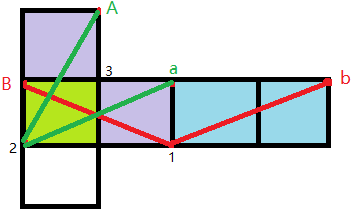

---
tags:
  - "#公考/行测/判断推理"
connect-url: https://www.bilibili.com/video/BV1vS4y1p7ea
---
## 怎么判断共点
1. 直角
	只有一延伸一垂直才共点
2. 马走日
	 [**定义**：马走日法跟象棋中的”马“走法一样，先找到一个点，通过走两个”日“可以找到另一个公共点，另一个也可以通过这个方法找到第三个点，这三个点就是三个面的公共点。](https://saduck.top/%E5%88%A4%E6%96%AD%E6%8E%A8%E7%90%86/%E5%9B%BE%E5%BD%A2%E6%8E%A8%E7%90%86/%E7%A9%BA%E9%97%B4%E9%87%8D%E6%9E%84.html#%E9%A9%AC%E8%B5%B0%E6%97%A5%E6%B3%95)
	 

## 方法
定寻马挂

1. 定：定面，定下基准面（非中心对称、非重复、正面优先）
2. 寻：寻找相邻面，定第二个面（如果找不到，利用马走日法）
3. 马：马走日法找共点
4. 挂：以共点挂第三个面，定下三面
