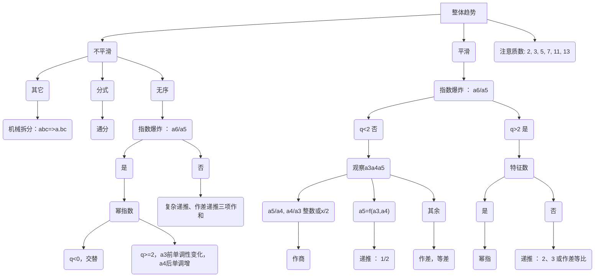

常见方法：作差、作和、作商、递推、分式、其它
每一个数列都有一定特点
1. 整体-趋势
2. 部分-$\frac{a_{n+1}}{a_{n}}$

$$
a_{1},a_{2},a_{3},a_{4},a_{5},a_{6}
$$

## 一、作减法
$$
a_{n+1}-a_{n}=f(n)
$$
### 1.1 $f(n)$是等差数列
$$
f(n)=b_{1}+(n-1)d
$$
$$
\begin{cases}
a_{n+1}-a_{n}=2n\\
a_{1}=1
\end{cases}\implies
a_{n}=n^{2}-n+1
$$
$a_{n}$是二次函数，特点如下：
1. 平滑（也就是没有上上下下，只有一个驻点）
2. $\lim_{ n \to \infty } \frac{a_{n+1}}{a_{n}}=1$ 也就是越到后面相邻数之间的倍数越来越小，趋近于1

### 1.2 多级作差后等差
$$
\begin{cases}
a_{n}=a_{1}+(n-1)d \\
b_{n}=\frac{d}{2}n^{2}+\left( a_{1}-\frac{3}{2}d \right)n+d+b_{1}-a_{1} \\
c_{n}=\frac{d}{6}n^{3}+\left( \frac{a_{1}}{2}-d \right)n^{2}+\left( \frac{11}{6}d-\frac{3}{2}a_{1}+b_{1} \right)n+a_{1}+c_{1}-d-b_{1}
\end{cases}
$$
$c_{n}$是三次函数，特点
1. 平滑
2. $\lim_{ n \to \infty }\frac{a_{n+1}}{a_{n}}=1$ （在前几项比值可能会递增，但是后几项会递减趋近于1）

### 1.3 作差后为等比数列
$$
a_{n+1}-a_{n}=f(n)
$$
$$
f(n)=b_{1}q^{n-1}
$$
特点：
1. 整体趋势平滑，$a_{6}-a_{5}$明显放大
2. $\lim_{ n \to \infty }\frac{a_{n+1}}{a_{n}}=q$
3. 需要注意，现在考得比较难，会将$q$设定为$\frac{3}{2}$，那么往往$a_{2}-a_{1}=16$（这个数能够与$\frac{3}{2}$多次相乘）

### 1.4 多级作差后等比
特点同[1.3](数字推理.md#1.3%20作差后为等比数列)

## 二、作加法
$$
a_{n+1}+a_{n}=f(n)
$$
### 2.1 $f(n)$是等差数列
是一个参差的函数（不平滑）
$$
\begin{cases}
n为奇， & b_{n}=-\frac{5}{2}n-\frac{11}{2} \\
n为偶， & b_{n}=\frac{5}{2}n-3
\end{cases}
\implies
\begin{cases}
a_{n}=(-1)^{n}b_{n}=\frac{5}{2}n+\frac{11}{2} \\
a_{n}=(-1)^{n}b_{n}=\frac{5}{2}n-3
\end{cases}
$$
本源上是分奇偶的两个数列

### 2.2 $f(n)$是等比数列
$$
\begin{cases}
a_{n+1}+a_{n}=2^n \\
a_{1}=2
\end{cases}
\implies
a_{n}=\begin{cases}
\frac{2^{n}}{3}+\frac{4}{3} & n为奇数 \\
\frac{2^{n}}{3}-\frac{4}{3} & n为偶数
\end{cases}
$$

### 2.3 先作和再作差得等差数列
$$
f(n)=n^{2}-n+1
$$
也就是作和之后得到一个二次函数
特点：
1. 奇数位与偶数位各自平滑
2. $\lim_{ n \to \infty } \frac{a_{n+1}}{a_{n}}$是大小交替的（也就是参差的），可以画出斜率，斜率大小交替

## 三、作除法
每个$\frac{a_{n+1}}{a_{n}}$都可以整除、或有规律

## 四、二阶递推数列
$$a_{n+2}=pa_{n+1}+qn$$
特点：
1. $\lim_{ n \to \infty }\frac{a_{n+1}}{a_{n}}$趋近于$q$（一般大于2，如果小于2会出现分数）
挺难的，遇到作差作和作商都做不出来的时候，考虑这个

## 五、幂指+修正
> 去发现这个数列的一些特征数值

特点：
1. 27、32、64、81附近的数字连续出现
2. 后期会放大（指数爆炸）

## 六、分式
1. 作除，单调且能除
2. 通分，分子、分母各成或互成规律

## 总结

```markmap
# 整体趋势
## 不平滑
### 其它
- 机械拆分：abc=>a.bc
### 分式
- 通分
### 无序
#### 指数爆炸（a6/a5）
##### 是
###### 幂指数
1. q<0，交替
2. q>=2，a3前单调性变化，a4后单调增
##### 否
- 复杂递推、作差递推三项作和
## 平滑
### 指数爆炸（a6/a5）
#### q<2 否
##### 观察a3a4a5
###### a5/a4,a4/a3整数或x/2
- 作商
###### a5=f(a3,a4)
- 递推（1/2）
###### 其余
- 作差，等差
#### q>2 是
##### 特征数
###### 是
- 幂指
###### 否
- 递推（2、3）或作差等比
## 注意质数
- 2，3，5，7，11，13
```



